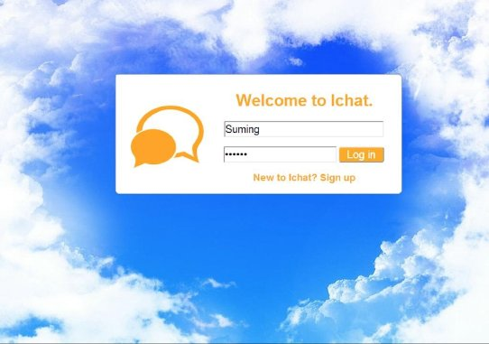
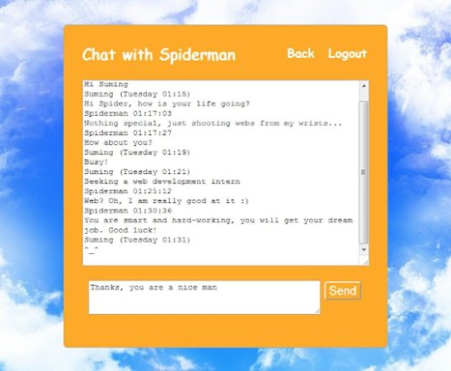
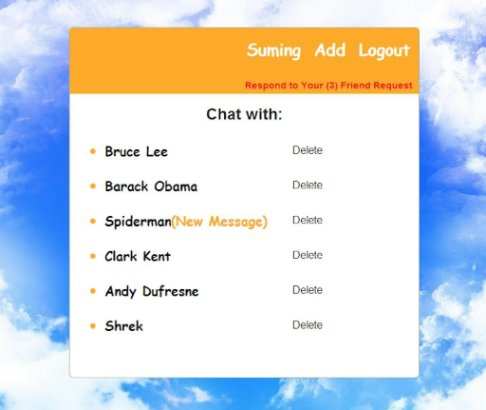
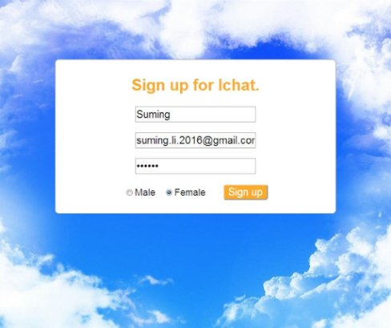

# Ichat: Chatting Application with WAMP

– Developed a dynamic web application to enable users to chat with friends, send requests, receive
notifications, and add friends.

– Created a user-friendly interface using HTML, CSS, and JavaScript.

– Implemented backend with Apache HTTP Server, MySQL, and PHP.

Function and its file:

Register -- signup.php, users.php

Logon(the same user cannot log on in different browers at the same time) -- verify.php, index.php

Add friends -- add.php, friends.php, request.php, agreerequest.php, refuserequest.php

Delete friends -- delfriend.php

Chat -- sendmes.php, getmes.php, message.php

Show new message -- index.php

Logout -- exit.php

1 Please import ichat.sql into your database and change root and password in these files to make sure you can connect MySQL.

2 Run index.php in two different browsers and enjoy chatting with yourself. 
